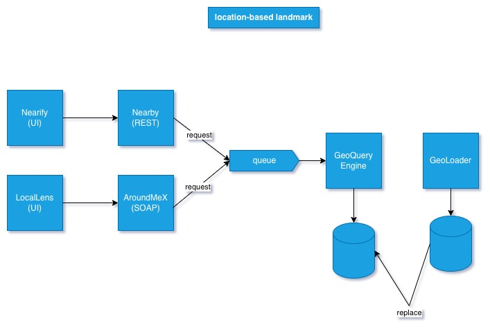

**Work In Progress**

### **Location-Based Landmark System**

The Location-Based Landmark System is a microservices-based platform designed to provide location-based landmark recommendations. It supports both REST and SOAP clients, processes requests asynchronously through a messaging queue, and retrieves nearby landmarks using spatial queries on a geospatial database.

### Architecture Diagram

### Technologies
- Java / Spring Boot
- RabbitMQ
- PostgreSQL + PostGIS + PGRouting
- OpenStreetMap (OSM) data
