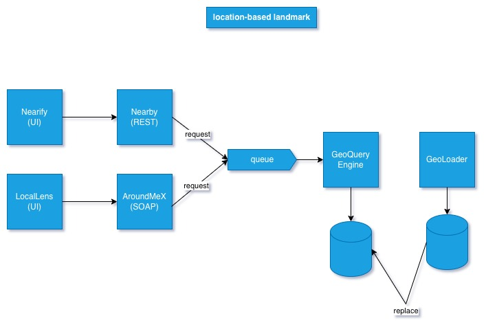

**Work In Progress**

### **Location-Based Landmark System**
<p>
The Location-Based Landmark System is a microservices-based platform designed to provide location-based landmark recommendations. It supports both REST and SOAP clients, processes requests asynchronously through a messaging queue, and retrieves nearby landmarks using spatial queries on a geospatial database.
</p>

### Architecture Diagram


### Technologies
- Java / Spring Boot
- RabbitMQ
- PostgreSQL + PostGIS + PGRouting
- OpenStreetMap (OSM) data

---
### 🚀 Running the System

1️⃣ Build Everything.
```
docker compose build --no-cache
```
2️⃣ Run Infrastructure Only in Docker.<br/>
This allows to start landmark apps manually from IDE.
```
docker compose up
```
3️⃣ Run Infrastructure + Landmark Apps in Docker.
```
docker compose --profile landmark up
```
4️⃣ Run Everything Except One Service (Run It Locally).
This allows to start `landmark-geo-query-engine` manually from IDE.
```
docker compose --profile landmark up --scale landmark-geo-query-engine=0
```

---
### 🛑 Stopping the System

Stop infrastructure:
```
docker compose down -v
```
Stop with profile:
```
docker compose --profile landmark down -v
```
`-v` removes associated Docker volumes.

---
🔗 Access URLs

| Service          | URL                                              |
| ---------------- | ------------------------------------------------ |
| RabbitMQ         | [http://localhost:15672](http://localhost:15672) |
| pgAdmin          | [http://localhost:5050](http://localhost:5050)   |
| Prometheus       | [http://localhost:9090](http://localhost:9090)   |
| Grafana          | [http://localhost:3000](http://localhost:3000)   |
| Nearify API      | [http://localhost:8084](http://localhost:8084)   |
| Nearby API       | [http://localhost:8086](http://localhost:8086)   |
| Geo Query Engine | [http://localhost:8087](http://localhost:8087)   |


---
### 🧪 Development Workflow:
1. Start infrastructure
2. Disable the service under development
3. Run that service locally from IDE
4. Connect to Docker services (DB, RabbitMQ)
Example:
```
docker compose --profile landmark up --scale landmark-geo-query-engine=0
```

